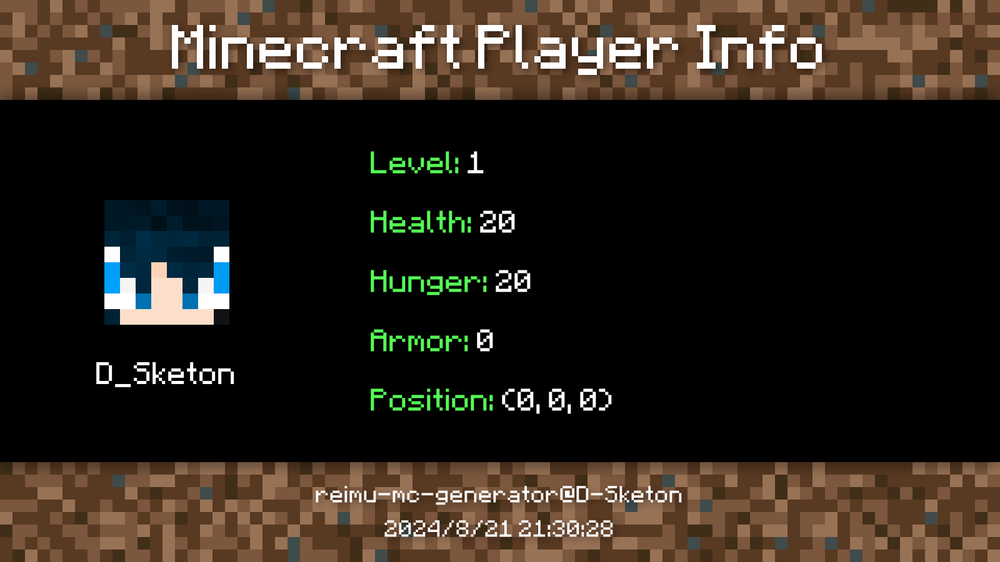
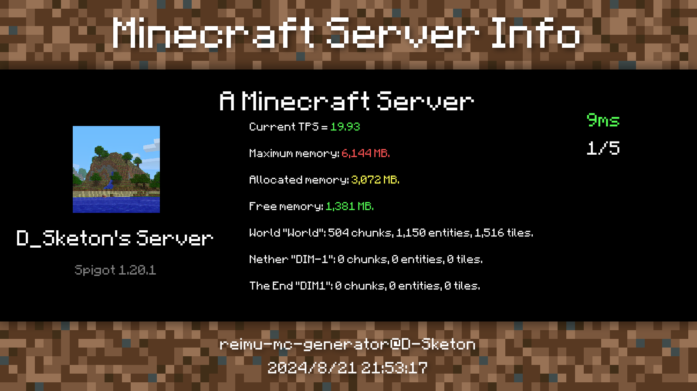

<div align = center>
  
  <h1>reimu-mc-generator</h1>
  <h4>Generate minecraft player and server information images with reimu-mc-generator.</h4>
</div>

## Install

```bash
npm i reimu-mc-generator
```

## Usage

```ts
// Use this option to save the image to a file
type WriteFileOptions = {
  type: "file";
  path: string;
};
// Use this option to get the base64 string of the image
type Base64Options = {
  type: "base64";
};
type Options = WriteFileOptions | Base64Options;

// Use this function to draw player information
function drawPlayerInfo(
  playerName: string,
  basicInfo: string[],
  options: Options
): Promise<string>;

// Use this function to draw server information
function drawServerInfo(
  serverName: string,
  basicInfo: string[],
  ip: string,
  port: number,
  showUrl: boolean,
  options: Options
): Promise<string>;
```

## Example

### Player Info

```ts
await drawPlayerInfo(
  "D_Sketon",
  [
    "§aLevel: §f1",
    "§aHealth: §f20",
    "§aHunger: §f20",
    "§aArmor: §f0",
    "§aPosition: §f(0, 0, 0)",
  ],
  { type: "file", path: "player.png" }
);
```



### Server Info

```ts
await drawServerInfo(
  "D_Sketon's Server",
  [
    "Current TPS = §a19.93",
    "Maximum memory: §c6,144 MB.",
    "Allocated memory: §e3,072 MB.",
    "Free memory: §a1,381 MB.",
    'World "World": 504 chunks, 1,150 entities, 1,516 tiles.',
    'Nether "DIM-1": 0 chunks, 0 entities, 0 tiles.',
    'The End "DIM1": 0 chunks, 0 entities, 0 tiles.',
  ],
  "localhost",
  25565,
  false,
  { type: "file", path: "server.png" }
);
```



## License

The CODE of reimu-mc-generator is under the [GPL-3.0](https://www.gnu.org/licenses/gpl-3.0.html) license.

The IMAGE generated by reimu-mc-generator is under the [CC BY-NC-SA 4.0](https://creativecommons.org/licenses/by-nc-sa/4.0/) license.